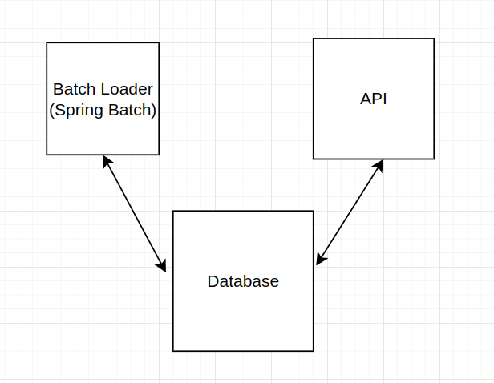

## Crypto recommendation service

### Task technical description can be found [here](task/CryptoRecommendationsService1.pdf)

### The diagram

### Design concepts

- Files are loaded using Spring Batch
- After files loading monthly and daily statistics is saved into DB for future fast access
- Rate limitation is implemented using Bucket4j
- Documentation is exposed through Swagger
- multi-module structure is used: api and batchloader 

### Fast start

- create packages:
`mvn package`
- start docker containers with:
`docker compose up -d`
- api documentation is available [here](http://localhost:9090/swagger-ui/)
